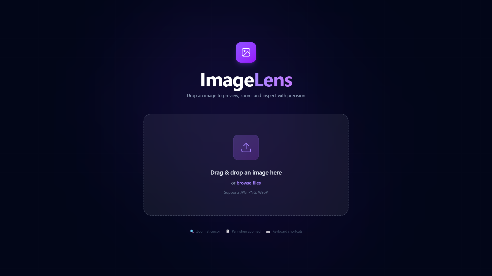

# 🖼️ React Image Lens

A modern, high-performance image viewer built with **React + TypeScript**, designed to deliver a smooth and interactive zooming experience — just like professional image inspection tools.

---

---

## ✨ Features

### 📂 Image Upload
- Drag & drop support with **interactive visual feedback**
  - Animated border
  - Pulse ring effect
  - Icon rotation
- Click-to-upload fallback (file picker support)
- Supports multiple formats:
  - ✅ JPG
  - ✅ PNG
  - ✅ WebP
- Built-in file validation for type safety

---

### 🔍 Image Viewing Experience
- Full-screen image preview with a **clean, distraction-free UI**
- Cursor-based zoom (zoom focuses where your mouse is — not center)
- Smooth panning when zoomed in (click & drag)
- Reset zoom functionality
- Live zoom percentage indicator

---

### 🎯 Controls & Shortcuts
- Keyboard shortcuts for faster interaction:
  - `+` → Zoom in
  - `-` → Zoom out
  - `0` → Reset zoom
  - `Esc` → Exit preview
- On-screen zoom indicator with auto fade-out

---

### 🎨 UI & Animations
- Built using **Framer Motion** for smooth animations:
  - Dropzone transitions
  - Micro-interactions
  - Hover effects
- Glassmorphism design:
  - Backdrop blur
  - Soft gradients
  - Subtle grid background

---

### 📊 Image Details
- Displays useful metadata:
  - Resolution
  - File size
  - Format
- Skeleton loader with shimmer animation while loading images

---

### 📱 Responsiveness
- Desktop-first design with full mobile compatibility
- Works smoothly across different screen sizes

---

### 🧠 Type Safety
- Fully written in **TypeScript**
- Strong type definitions for better scalability and maintainability

---

## 🛠️ Tech Stack

- **React**
- **TypeScript**
- **Framer Motion**
- **Tailwind CSS**